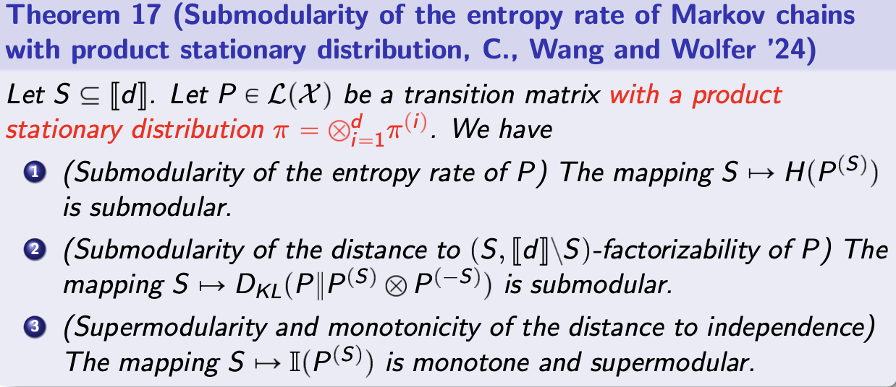

# Submodular optimization of multivariate Markov chains

The three submodular objectives we aim to optimize are:

* Entropy Rate: The mapping is submodular.
* Distance to Factorizability: The mapping is submodular.
* Distance to Independence: The mapping is monotone and supermodular.

# References
* Choi, M. C. H., Wang, Y., & Wolfer, G. (2024). A rate-distortion framework for MCMC algorithms: geometry and   factorization of multivariate Markov chains. arXiv. https://doi.org/10.48550/arxiv.2404.12589
* Wen, Z. (n.d.). Submodular Function Optimization. http://faculty.bicmr.pku.edu.cn/~wenzw/bigdata/lect-submodular.pdf